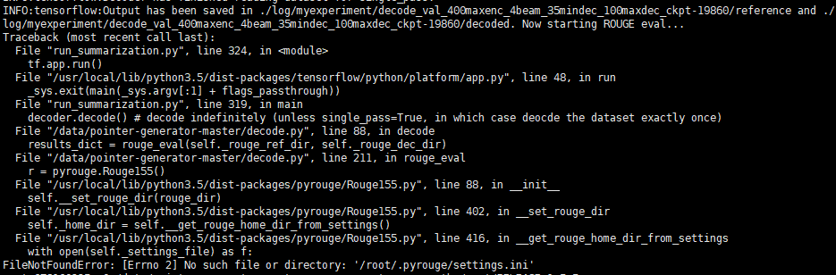
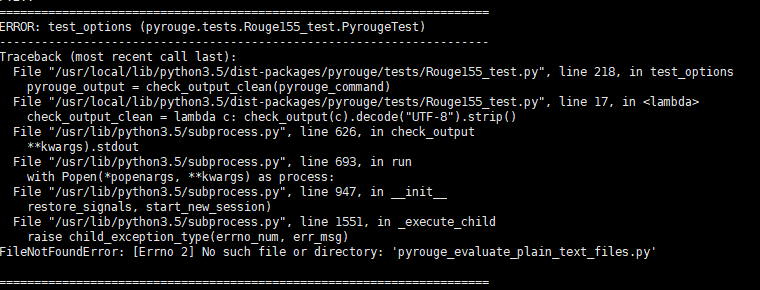

## 说在前面
自从实习之后好久没有更新博客了，实习归来，找工作告一段落，还是要继续写(bie)论文啦！ 
按照之前的打算，继续做文档自动摘要相关。近期在跑一篇论文的源码（[pointer-generator](https://github.com/abisee/pointer-generator)）。 
运行过程中，在计算ROUGE分数的时候遇到一些问题，靠着强大的度娘和万能的网友解决了，在此记录一下。

## 遇到的问题
运行最后一步，计算ROUGE分，报错：

查看教程，发现有段介绍如下：

> decode.py uses the Python package pyrouge to run ROUGE evaluation. pyrouge provides an easier-to-use interface for the official Perl ROUGE package, which you must install for pyrouge to work. 

要注意的是，这里有两个工具ROUGE和pyrouge。 
pyrouge（[下载地址](https://pypi.org/project/pyrouge/)，我是用的版本是0.1.3）是一个Python包，旨在通过自动将摘要转换为ROUGE理解的格式并自动生成ROUGE配置文件，使ROUGE得分更容易。**使用pyrouge必须安装ROUGE**。 

## ROUGE简介
ROUGE是由微软亚洲研究院知识挖掘组(The Knowledge Mining group at Microsoft Research Asia)调研经理(research manager) Chin-Yew Lin 研发的，用于摘要的自动评价，通过比较机器自动生成的摘要(called system_summary)与人工生成的摘要(called model_summary, 认为它是理想的)中重叠单元的数量，来评价机器自动生成的摘要。该方法中考虑的重叠单元有n-gram, word sequences, word-pairs等，并提出了四个测量标准ROUGE-N, ROUGE-L, ROUGE-W, ROUGE-S。
该包用Perl语言编写，代码中使用的版本为ROUGE-1.5.5。
后来我发现已经有ROUGE-2.0版本，好像是用java写的。。。 

教程中还有一段话：

> Note: As of 18th May 2017 the website for the official Perl package appears to be down. Unfortunately you need to download a directory called ROUGE-1.5.5 from there. As an alternative, it seems that you can get that directory from here (however, the version of pyrouge in that repo appears to be outdated, so best to install pyrouge from the official source).

大概的意思是，ROUGE的官网已经关闭，我们已经下不到ROUGE-1.5.5包，可以从其他地方寻找替代。
原来这是一个烂尾工程！！

## ROUGE安装教程
好了找到问题所在，上网寻找解决办法，真的找了好多资料啊我。 
功夫不负有心人，还真找到了一个，参考[这篇教程](https://blog.csdn.net/Hay54/article/details/78744912)成功安装ROUGE。真心给这个博主打call！ 
在添加ROUGE环境变量那一步，不知道为什么我的sudo geidt有些问题，所以直接用vim改写文件，添加环境变量。

	sudo vim /etc/profile

## 测试pyrouge是否能使用
按照[pyrouge](https://pypi.org/project/pyrouge/)的教程，进行测试。 
1. 安装pyrouge ```pip install pyrouge```
2. 告诉pyrouge ROUGE的绝对路径 ```pyrouge_set_rouge_path /absolute/path/to/ROUGE-1.5.5/directory``` 
例如我的ROUGE文件放在了/root/RELEASE-1.5.5下，就设置为
```pyrouge_set_rouge_path /root/RELEASE-1.5.5```
3. 运次测试 ```python -m pyrouge.test``` 

好了，如果一切没问题，就会显示
```
Ran 10 tests in 18.055s
OK
```
但是问题有这么简单吗，果然报错：


根据[这篇教程](https://blog.csdn.net/MerryCao/article/details/49174283)完美解决，发现问题及解决问题的过程博主介绍的非常详细。 
划重点！ 
修改Rouge155_test.py文件的第208行(test_options(self)函数中)如下：

    "pyrouge_evaluate_plain_text_files -m {} -s {} -sfp "
   同理对于test_write_config( )函数报错，修改Rouge155_test.py文件第192行如下：

    "pyrouge_write_config_file -m {m} -s {s} "

再次运行测试，error没有了，但是有几个failure。在[github的issue6里](https://github.com/bheinzerling/pyrouge/issues/6)，作者解释是因为测试用例已过时，建议更新到最新版本。 
我在Rouge155.py中并没有查到pyrouge_evaluate_plain_text_files相关字段，这个问题只出现在测试过程中，猜测正式代码没问题，测试的failure不解决应该没影响。

## 大功告成
一天的折腾，成功解决，代码可以成功计算出各种ROUGE分数！感谢几个给予帮助的博主！