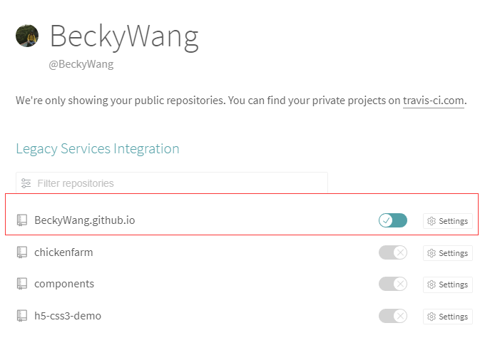
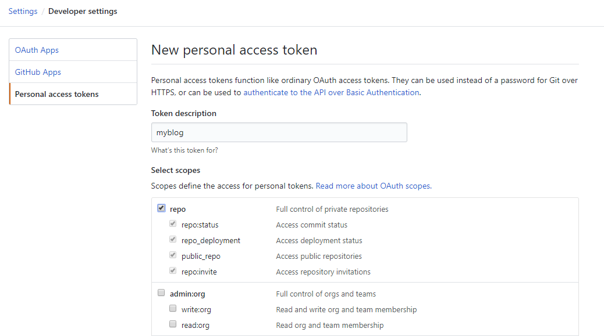
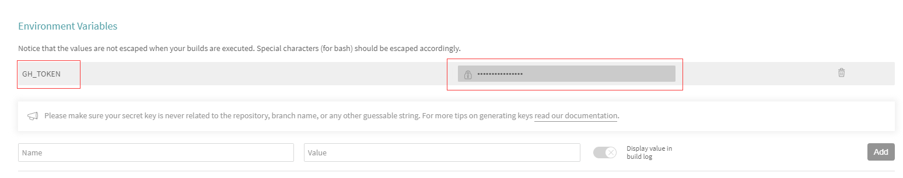
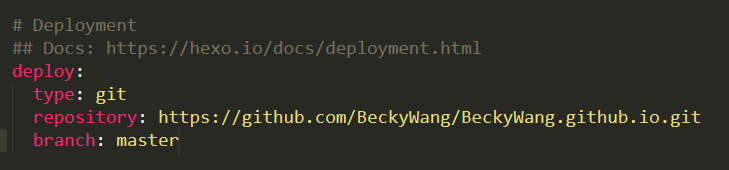
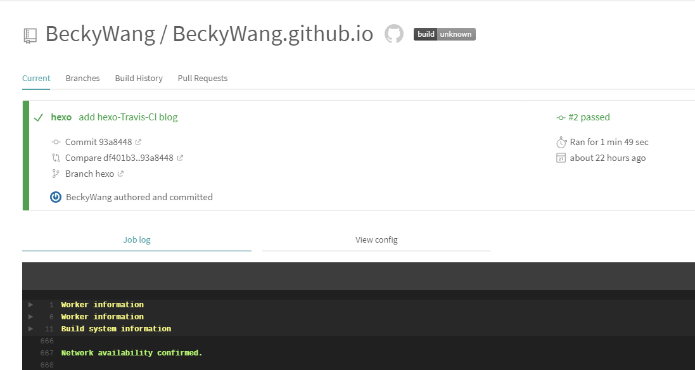
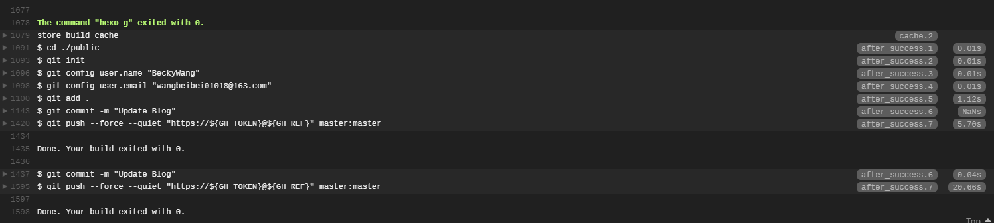

## 写在前面
说起来非常惭愧，作为一个技术人员，写博客这个习惯刚坚持没多久，虽然达不到‘高产似母猪’，但是追求记录自己学习工作中一点总结，并学会被逐渐提高博客质量！
博客是基于Hexo写的，Hexo是个好东西，搭建使用都非常方便，但是每次写完博客都要自己重新生成并部署github上去，‘手续’有点繁琐。最近学习测试的时候，看到大家都用Travis-CI来完成自动部署，免不了跟风学习一波。

## 什么是Travis-CI
>> 持续集成Continuous Integration 简称CI，指的是只要代码有变更，就自动运行构建和测试，反馈运行结果。确保符合预期以后，再将新代码"集成"到主干。好处在于，每次代码的小幅变更，就能看到运行结果，从而不断累积小的变更，而不是在开发周期结束时，一下子合并一大块代码。

Travis-CI提供的就是CI功能，通过绑定github上面的项目，只要你提交了新的代码，便会自动抓取，根据配置文件，提供一个运行环境，并自动运行一些命令，完成部署。

要想让hexo自动部署，即让Travis-CI在node环境下运行hexo g等命令，完成博客的部署。

## 我的博客架构
我的博客是使用Hexo来搭建的，托管到Github提供的Gitpage服务上的。
生成后的HTML文件和博客的源文件是放在同一个仓库的，只是在不同的分支。
master：博客的静态文件，也就是hexo生成后的HTML文件（因为要使用Gitpage服务，所以他规定的网页文件必须是在master分支）。
hexo：博客的源文件，每次在电脑上提交文件，就是提交到这个分支。

## 启用要构建的项目
Travis-CI只支持 Github，不支持其他代码托管服务。首先使用github登录Travis-CI，Travis会列出你所有的仓库，选择需要构建的仓库，打开旁边的按钮。一旦激活了一个仓库，Travis 会监听这个仓库的所有变化。

进入setting，进行一些配置。

Build only if .travis.yml is present：是只有在.travis.yml文件中配置的分支改变了才构建。
至此，我们已经开启了要构建的仓库，下面要解决的就是Travis CI怎么访问github。

## 配置Github的Access Token
### 在github上生成Access Token
头像下面的settings -> Developer setting -> Personal access tokens。
点击右上角的Generate new token按钮会重新生成一个，勾选一些权限，选择repo就行。

生成完后，你需要记住下来，之后为了安全就不会显示了，如果忘了只能重新生成一个了，拷贝完以后我们需要到Travis CI网站配置下。

### 在Travis CI配置
进入刚刚部署的博客项目的setting页面，填写环境变量，这里的名字待会会在项目配置文件中用到。

在这里配置是因为写在程序里不安全，配置到这里相当于一个环境变量，我们在构建的时候就可以引用他。 

## 创建travis设置文件
回到仓库本地目录，在该目录下新建一个.travis.yml文件。直接上配置代码。

	language: node_js
	node_js: stable
		
	addons:
	  apt:
	    update: true
		
	cache:
	  directories: 
	  - node_modules
		
	install:
	- npm install
		
	# before_script:
		
	script:
	- hexo g
		
	after_success:
	- cd ./public
	- git init
	- git config user.name "BeckyWang"
	- git config user.email "wangbeibei01018@163.com"
	- git add .
	- git commit -m "Update Blog"
	- git push --force --quiet "https://${GH_TOKEN}@${GH_REF}" master:master
		
	branches:
	  only:
	  - hexo
		
	env:
	  global:
	  - GH_REF: github.com/BeckyWang/BeckyWang.github.io.git

他按照我们指定的脚本顺序执行，先是install，再是before_script，script，最后是after_script。
branches指定了执行脚本的分支（即是博客源代码所在的分支）。
全局变量GH_REF指定了你的仓库地址。GH_TOKEN即是上一步在Travis CI配置的环境变量。

首先用npm install在 travis 这台全新的主机上进行相关依赖的安装（如果在另外一台电脑上写博客，就不需要重新再安装一遍 hexo），然后进行初始化。

安装完所需依赖之后，就可以直接使用 hexo 命令。用hexo g命令来生成静态文件，生成的静态文件默认会被放在 public 目录下。
我们cd到public目录，用git init初始化仓库，进行相关信息的设置。
最后，travis-ci会将public目录下的文件全部 push 到你所创建仓库的 master 分支上去。

可以看出travis其实就是一个帮你跑脚本的云主机命令行。

**p.s.** 在hexo的配置文件_config.yml里有，要是用https协议拉取或更新代码。

## 大功告成
至此，新写一篇博客，commit并push到github里，进入Travis里，可以看到已经在自动部署了。

等待一会，看到以下出现，即部署成功。

进入自己的博客，便可以看见新写的博客粗来了！

参考网站
[如何快速搭建一个有域名且持续集成的hexo博客(2.0版)](https://juejin.im/post/596e39916fb9a06baf2ed273)
[手把手教你使用Travis CI自动部署你的Hexo博客到Github上](https://blog.csdn.net/woblog/article/details/51319364)
[持续集成服务 Travis CI 教程](http://www.ruanyifeng.com/blog/2017/12/travis_ci_tutorial.html)