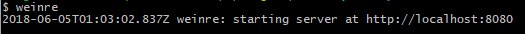
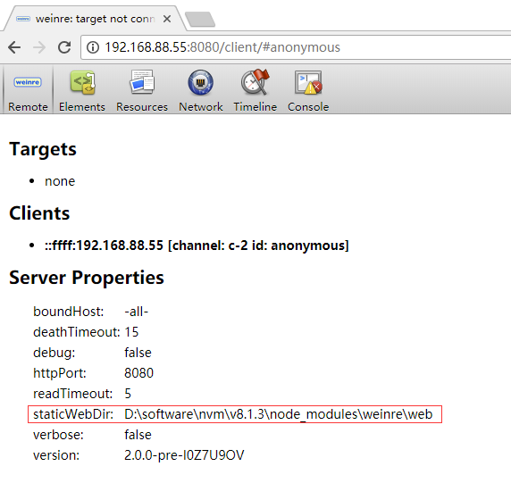
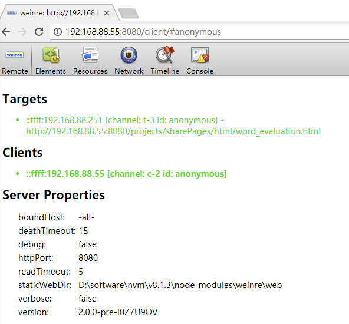
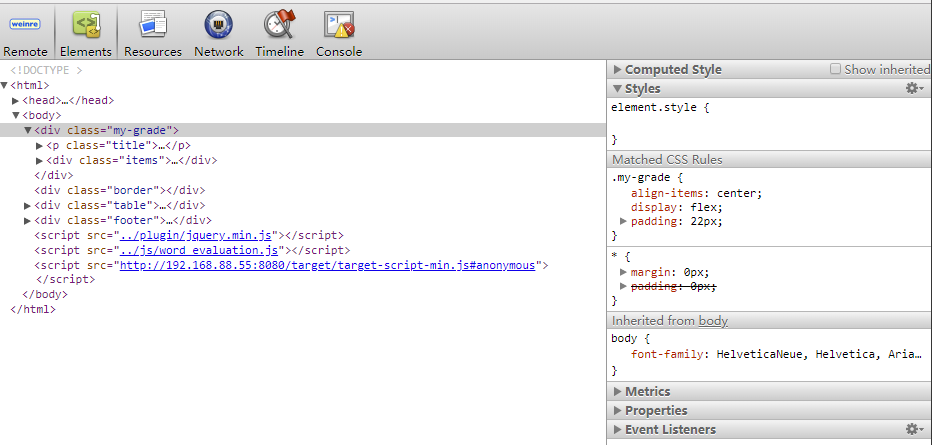

## weinre简介

 Weinre(Web Inspector Remote)是一款基于Web Inspector(Webkit)的远程调试工具，它使用JS编写，可以让我们在电脑上直接调试运行在手机上的远程页面。
在PC上可以即时修改目标网页的HTML/CSS/Javascript，调试过程可实时显示移动设备上页面的预览效果，并同步显示设备页面的错误和警告信息，可以查看网络资源的信息，不过**weinre不支持断点调试**。

## weinre的使用

### 安装及运行
	npm install -g weinre

测试是否安装成功，命令行输入：weinre，回车，开启服务。
若运行成功，输出：

注意，虽然这样是运行成功了，但是这样操作只能在PC的浏览器通过<http://localhost:8080>访问，将localhost换做本地ip就无法打开Weinre调试工具，为了能在其他设备以及本地设备用ip打开Weinre调试工具，需要输入：
			
	weinre --boundHost -all-

上面默认的是8080端口，weinre还有其他参数：	

	weinre --boundHost [hostname | ip address |-all-]  --httpPort [port]

ip address可以是你的电脑的ip地址，port是自定义端口号。
运行成功后，在PC浏览器输入：http://&lt;你的电脑IP地址&gt;:8080，浏览器显示页面如下：

红框中的地址是Debug Client(Weinre调试工具)的用户访问接口，可以通过这个地址进入Debug Client。
蓝框是Target Script，这个地址是系统根据我们启动Weinre服务时的参数设置生成的target-script.js文件的链接地址。我们需要将这个js文件嵌入到待测试的页面中。要注意的是不要使用localhost:8080打开Weinre服务，否则生成的TargetScript链接也以localhost开头，这样直接复制到手机，就无法获取到文件了。

### 移动端连接
点开Debug Client的链接，显示页面：

首先将上一步的Target Script嵌入测试页面底部，然后将测试文件放在staticWebDir目录下（红框标出的，staticWebDir的目录即是你安装weinre的根目录）。
例如我的测试页面是index.html，放在staticWebDir目录下，手机打开浏览器输入<http://192.168.88.55:8080/index.html>，大功告成，手机可以看到测试页面。

### 调试
在进入调试步骤前，要确保我们选中正确的Targets，PC浏览器remote面板显示如下图，选择待调试设备的ip，选中会显示绿色：

1. 调试DOM/CSS
切换至ElementsTab，可以看到调试页面的html结构, 在这里我们就可以像调试本地页面一样的修改这个文件,可以修改DOM结构也可以修改元素样式。

2. 调试ajax请求
切换至NetworkTab, 在这里可以看到我们发送的ajax请求。
这个与我们平时调试本地页面一样，不同的只是这里不能显示页面加载资源的情况，比如页面中引入的js, css, img文件的加载情况，所以如果资源加载错误， 在这里是无法看出来的。 

3. 本地存储
切换至ResourcesTab，这是对应本地调试工具的一个缩减版，可以看到只有Database, Local Storage与Session Storage三项。

4. console面板
切换至ConsoleTab，这里基本与本地调试时console的功能一致，可以输入执行一些js代码，也可以显示console输出的信息。

**p.s.** Ajax请求与Console的输出要发生在Target连接成功之后才能看到结果。

更多请参考[这里](https://github.com/nupthale/weinre)。